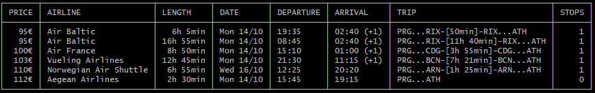
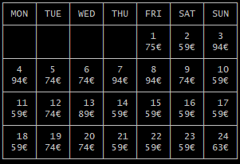
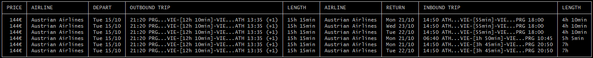
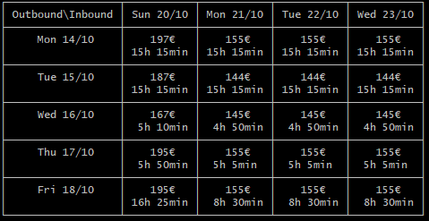

[ ](https://travis-ci.com/gmantaos/eurogo)
[](https://codecov.io/gh/gmantaos/eurogo)
[](LICENSE)
[](https://goreportcard.com/report/github.com/gmantaos/eurogo)
[](https://codeclimate.com/github.com/gmantaos/eurogo)

## Usage

### Search for airport codes

```shell
$ eurogo airport London
LOND  London, United Kingdom
LHR  London Heathrow, London, United Kingdom
LGW  London Gatwick, London, United Kingdom
STN  London Stansted, London, United Kingdom
LTN  London Luton, London, United Kingdom
LCY  London City, London, United Kingdom
SEN  London, United Kingdom
LDY  Derry, United Kingdom
YXU  London, London, Canada
ELS  Ben Schoeman, East London, South Africa

```

### Search for one-way flights

On specific dates.

```shell
$ ./eurogo flight PRG ATH --depart-on 2019-10-14 --depart-on 2019-10-16 -c 4
```




Use the `-c` parameter to limit the number of results.

On a range of dates.

```shell
$ ./eurogo flight PRG ATH --depart-from 2019-10-14 --depart-to 2019-10-16
```

Over a whole month.

```shell
./eurogo flight-month PRG ATH 2019-11
```



### Search for round-trips

Defining date ranges is similar to searching for one-way flights.

```shell
$ ./eurogo flight PRG ATH --depart-from 2019-10-14 --depart-to 2019-10-16 --return-from 2019-10-20 --return-to 2019-10-23 -c 6
```



Add the `--calendar` option to get a lowest-fare calendar instead.

```shell
$ ./eurogo flight PRG ATH --depart-from 2019-10-14 --depart-to 2019-10-18 --return-from 2019-10-20 --return-to 2019-10-23 --calendar
```



